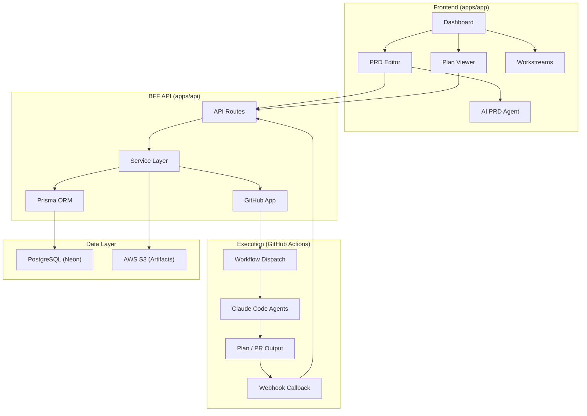
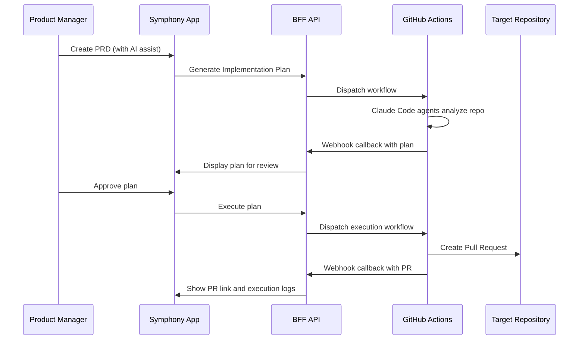

# Symphony - AI-Powered Software Delivery Platform

<div>
  
  
  
  
</div>

<br/>

**Human-governed, AI-centric software delivery platform that transforms intent into high-quality software.**

## Overview

Symphony is a SaaS platform where AI agents produce delivery artifacts (PRDs, implementation plans, code, test reports) while humans approve and refine them at every stage. It serves the entire software delivery team — product managers, designers, engineers, and QA — not just developers.

Built as a Next.js monorepo on the [next-forge](https://github.com/vercel/next-forge) template, Symphony follows a hybrid architecture: source code never leaves customer infrastructure (execution happens via GitHub Actions), while the cloud-based control plane orchestrates workflows, manages approvals, and integrates with tools teams already use.

### What Problem Does This Solve?

| Challenge | Symphony Approach |
|-----------|-------------------|
| PRDs lack technical grounding | AI generates PRDs with full codebase context via conversational agent |
| Plans drift from requirements | Implementation plans are generated from PRDs with traceability |
| Handoffs lose context | Every artifact links to its parent — PRD to plan to PR |
| Reviews happen too late | 13 quality judges evaluate plans before implementation begins |
| Cross-team visibility is fragmented | Single platform for PM, design, engineering, and QA with Linear and Slack integration |

## Architecture



### Core Workflow



## Apps

| App | Port | Description |
|-----|------|-------------|
| **app** | 3000 | Main authenticated application — dashboard, artifact editor, workstream tracking |
| **api** | 3002 | Backend-for-Frontend API — all database operations, webhooks, service integrations |
| **web** | 3001 | Marketing website with pricing and contact |
| **docs** | 3004 | Documentation site (Mintlify) |
| **email** | 3003 | Email template preview (React Email) |
| **storybook** | 6006 | Component library |
| **studio** | 3005 | Prisma Studio for database browsing |

## Packages

Shared packages imported as `@repo/<package-name>`:

| Package | Purpose |
|---------|---------|
| **database** | Prisma ORM, schema, migrations (PostgreSQL / Neon) |
| **api** | Shared API type definitions between frontend and backend |
| **auth** | Clerk authentication |
| **ai** | Anthropic AI integration (PRD generation agent, Claude Opus/Sonnet) |
| **github** | GitHub App integration (workflow dispatch, webhooks, repo management) |
| **linear** | Linear integration (OAuth, issue sync, task export) |
| **design-system** | Shadcn/ui component library with Tailwind |
| **rich-text** | TipTap rich text editor with Mermaid diagram support |
| **collaboration** | Real-time collaboration via Liveblocks + Yjs |
| **payments** | Stripe subscription management |
| **analytics** | PostHog + Google Analytics + Vercel Analytics |
| **observability** | Error tracking and logging (BetterStack) |
| **security** | Arcjet bot detection, shield, rate limiting |
| **notifications** | In-app notifications via Knock |
| **feature-flags** | Feature flag management (Vercel Flags + PostHog) |
| **aws** | S3 artifact storage with presigned URLs |
| **email** | Transactional emails via Resend |
| **webhooks** | Inbound/outbound webhook handling (Svix) |
| **storage** | File upload (Vercel Blob) |
| **cms** | Marketing site content (BaseHub) |

## Getting Started

### Prerequisites

| Requirement | Purpose | Install |
|-------------|---------|---------|
| **Node.js 20+** | Runtime | [nodejs.org](https://nodejs.org) or `brew install node` |
| **pnpm** | Package manager | `npm install -g pnpm` or [pnpm.io](https://pnpm.io) |
| **Docker** | Local PostgreSQL 16 | [docker.com](https://www.docker.com/get-started) |
| **Stripe CLI** | Local webhook testing | [docs.stripe.com](https://docs.stripe.com/stripe-cli) |

### Service Accounts

Symphony integrates with several third-party services. At minimum you need accounts for:

| Service | Required | Purpose | Setup |
|---------|----------|---------|-------|
| **[Clerk](https://clerk.com)** | Yes | Authentication, user/org management | Create app, get publishable + secret keys |
| **PostgreSQL** | Yes | Primary database (via Docker locally, [Neon](https://neon.tech) in prod) | `docker compose up -d` |
| **[GitHub App](https://docs.github.com/en/apps)** | For plan generation | Workflow dispatch, webhook events, repo access | See [docs/github-app-setup.md](docs/github-app-setup.md) |
| **[Stripe](https://stripe.com)** | For payments | Subscription management | Create account, get API keys |
| **[Anthropic](https://console.anthropic.com)** | For AI features | PRD generation agent (Claude Opus/Sonnet) | Get API key |
| **[AWS S3](https://aws.amazon.com/s3/)** | For artifact storage | Plan files, execution logs, screenshots | Create bucket + IAM credentials |
| **[Liveblocks](https://liveblocks.io)** | For collaboration | Real-time document editing, live cursors | Create project, get secret key |
| **[PostHog](https://posthog.com)** | Optional | Product analytics, feature flags | Create project, get API key |
| **[Linear](https://linear.app)** | Optional | Issue sync, task export | OAuth setup |
| **[Resend](https://resend.com)** | Optional | Transactional emails | Get API key |
| **[Knock](https://knock.app)** | Optional | In-app notifications | Create account, get API + feed channel keys |
| **[BaseHub](https://basehub.com)** | Optional | CMS for marketing site blog/docs | Get token |
| **[Arcjet](https://arcjet.com)** | Optional | Bot detection, rate limiting, attack protection | Get API key |
| **[Vercel](https://vercel.com)** | For deployment | Hosting, edge functions, blob storage, analytics | Connect repo |

See **[docs/local_deployment.md](docs/local_deployment.md)** for step-by-step configuration of each service.

### Quick Start

```bash
# Clone and install
git clone git@github.com:closedloop-ai/symphony-alpha.git
cd symphony-alpha
pnpm install

# Start local database
docker compose up -d

# Configure environment variables (see docs/local_deployment.md)
cp apps/app/.env.example apps/app/.env.local
cp apps/api/.env.example apps/api/.env.local
cp apps/web/.env.example apps/web/.env.local

# Run database migrations
cd packages/database && pnpm prisma migrate dev && cd ../..

# Start all apps
pnpm dev
```

See **[docs/local_deployment.md](docs/local_deployment.md)** for the full setup guide including Clerk, Stripe, GitHub App, and other service account configuration.

### Common Commands

```bash
pnpm dev                                    # Start all apps
pnpm turbo dev --filter=app --filter=api    # Start specific apps only
pnpm build                                  # Build all packages/apps
pnpm typecheck                              # TypeScript type check
pnpm lint                                   # Lint and format check (Biome)
pnpm lint:fix                               # Auto-fix lint issues
pnpm test                                   # Run all tests
pnpm migrate                                # Format, generate, and db push (dev only)
```

## Key Features

- **AI-Assisted PRD Generation** — Conversational agent powered by Claude Opus/Sonnet with web search
- **Implementation Plan Generation** — AI analyzes target repo and produces actionable plans with acceptance criteria
- **Plan Execution** — One-click execution creates Pull Requests on the target repository
- **Quality Judges** — 13 evaluation agents score plans before implementation
- **Real-Time Collaboration** — Live cursors and concurrent document editing via Liveblocks
- **Artifact Versioning** — Full version history for all document artifacts
- **Workstream Tracking** — 17-state delivery lifecycle from INITIATED through COMPLETED
- **Multi-Org Support** — Organization switching with full data isolation
- **Integrations** — GitHub, Linear, Slack, Stripe for the full delivery workflow
- **Template System** — Organization-level templates for PRDs, Issues, and Bug reports

## Documentation

- **[Local Deployment Guide](docs/local_deployment.md)** — Full setup instructions and troubleshooting
- **[Database Schema](docs/database-schema.md)** — Entity relationships and data model
- **[GitHub App Setup](docs/github-app-setup.md)** — GitHub App configuration for workflow dispatch
- **[Product Overview](project-overview.md)** — Detailed system overview, API surface, and integration architecture

## Contributing

See **[CONTRIBUTING.md](CONTRIBUTING.md)** for the full guide including fork-based workflow, architecture conventions, code style, and testing requirements.

### Quick Dev Setup

```bash
# Fork on GitHub, then:
git clone git@github.com:YOUR_USERNAME/symphony-alpha.git
cd symphony-alpha
git remote add upstream git@github.com:closedloop-ai/symphony-alpha.git
pnpm install
docker compose up -d
pnpm dev
```

## Troubleshooting

**`pnpm typecheck` fails with "Property does not exist on type"**
- Run `pnpm install` then `cd packages/database && pnpm prisma generate`
- Stale Prisma client is the most common cause after rebasing

**Environment variable validation errors**
- Empty string `""` fails validation even for optional fields — comment out unused vars
- Keys are validated with prefixes (e.g., `sk_` for Clerk, `phc_` for PostHog)

**Database connection issues**
- Ensure Docker is running: `docker compose up -d`
- Check `.env.local` has the correct `DATABASE_URL`

**Biome lint errors after adding imports**
- Run `pnpm lint:fix` — Biome enforces `@repo/*` before `@/*` import order

## License

[Apache License 2.0](LICENSE) - Copyright 2025 ClosedLoop
