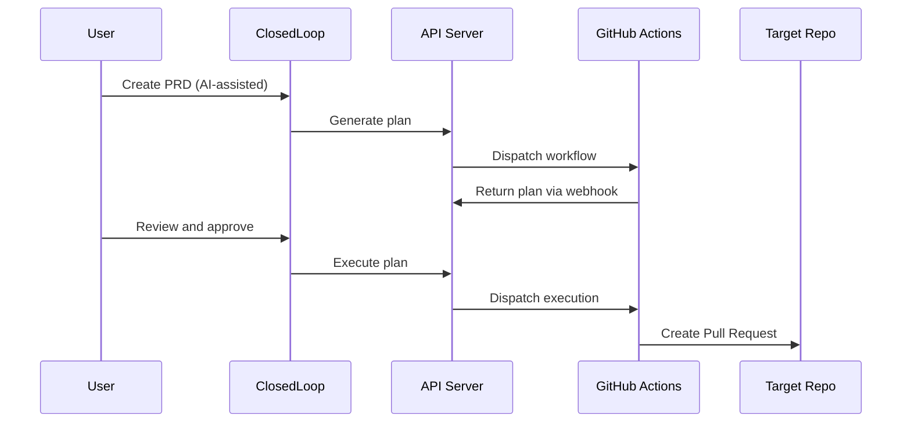

<p align="center">
  <h1 align="center">ClosedLoop.AI</h1>
</p>

<p align="center">
  The open-source workspace for team-based agentic software development.
</p>

<p align="center">
  <a href="LICENSE"></a>
  <a href="https://github.com/closedloop-ai/closedloop-ai/actions/workflows/pr-test.yml"></a>
  
  
</p>

<p align="center">
  <a href="#quick-start">Quick Start</a> &middot;
  <a href="#architecture">Architecture</a> &middot;
  <a href="docs/local_deployment.md">Deployment Guide</a> &middot;
  <a href="CONTRIBUTING.md">Contributing</a>
</p>

---

ClosedLoop is a platform where AI agents produce delivery artifacts (PRDs, implementation plans, code) and humans review them at every stage. Define requirements, generate plans, execute to PRs — all in one workspace visible to the whole team.

## Quick Start

**Prerequisites:** Node.js 20+, pnpm, Docker

```bash
git clone https://github.com/closedloop-ai/closedloop-ai.git
cd closedloop-ai
pnpm install
docker compose up -d        # Start PostgreSQL
pnpm migrate                # Run database migrations
pnpm dev                    # Start all apps
```

Open [http://localhost:3000](http://localhost:3000).

> First run automatically creates `.env.local` files from `.env.example` templates. Add your [Clerk](https://clerk.com) keys and other credentials — see the [Deployment Guide](docs/local_deployment.md).

### Service Accounts

| Service | Required | Purpose |
|---------|----------|---------|
| [Clerk](https://clerk.com) | Yes | Authentication |
| PostgreSQL | Yes | Database (Docker locally) |
| [GitHub App](docs/github-app-setup.md) | For execution | Workflow dispatch |
| [Anthropic](https://console.anthropic.com) | For AI features | Claude API |
| [Liveblocks](https://liveblocks.io) | For collaboration | Real-time editing |
| [PostHog](https://posthog.com) | Optional | Analytics |
| [Linear](https://linear.app) | Optional | Issue sync |

### Common Commands

```bash
pnpm dev                                    # Start all apps
pnpm turbo dev --filter=app --filter=api    # Start specific apps
pnpm build                                  # Build everything
pnpm typecheck                              # TypeScript check
pnpm lint                                   # Lint (Biome)
pnpm test                                   # Run tests
pnpm migrate                                # Database migrations
```

## Architecture

Next.js monorepo with Turborepo.

### Apps

| App | Port | Description |
|-----|------|-------------|
| **app** | 3000 | Main application — dashboard, editor, workstreams |
| **api** | 3002 | BFF API — database, webhooks, integrations |
| **web** | 3001 | Marketing site |
| **mcp** | 3010 | MCP server for Claude Code CLI |
| **relay** | 3020 | WebSocket relay for desktop compute |
| **storybook** | 6006 | Component library |
| **studio** | 3005 | Prisma Studio — database browser |

### Packages

Shared packages imported as `@repo/<name>`:

| Package | Purpose |
|---------|---------|
| **database** | Prisma ORM, schema, migrations |
| **api** | Shared type definitions |
| **auth** | Authentication (Clerk) |
| **ai** | Claude integration |
| **github** | GitHub App (dispatch, webhooks) |
| **design-system** | UI components (Shadcn + Tailwind) |
| **rich-text** | TipTap editor with Mermaid |
| **collaboration** | Real-time editing (Liveblocks) |
| **analytics** | PostHog + Google Analytics |
| **observability** | Structured logging |
| **email** | Transactional email (Resend) |

### Core Workflow



## Contributing

We welcome contributions. See **[CONTRIBUTING.md](CONTRIBUTING.md)** for conventions, code style, and testing requirements.

```bash
# Fork on GitHub, then:
git clone git@github.com:YOUR_USERNAME/closedloop-ai.git
cd closedloop-ai
git remote add upstream git@github.com:closedloop-ai/closedloop-ai.git
pnpm install && docker compose up -d && pnpm dev
```

## Documentation

- **[Local Deployment Guide](docs/local_deployment.md)** — Full setup and troubleshooting
- **[Database Schema](docs/database-schema.md)** — Entity relationships and data model
- **[GitHub App Setup](docs/github-app-setup.md)** — Workflow dispatch configuration
- **[Product Overview](project-overview.md)** — System architecture and API surface

## Troubleshooting

| Problem | Fix |
|---------|-----|
| `pnpm typecheck` fails with "Property does not exist" | `pnpm install && cd packages/database && pnpm prisma generate` |
| Environment variable validation errors | Comment out unused vars (empty `""` fails validation) |
| Database connection issues | `docker compose up -d` and check `DATABASE_URL` in `.env.local` |

## Legacy Identifiers

Some internal identifiers use "Symphony" (an earlier codename). These don't affect the product and are preserved to avoid breaking runtime behavior — e.g., `/api/gateway/symphony/*` routes.

## License

[MIT](LICENSE) &copy; 2026 ClosedLoop
