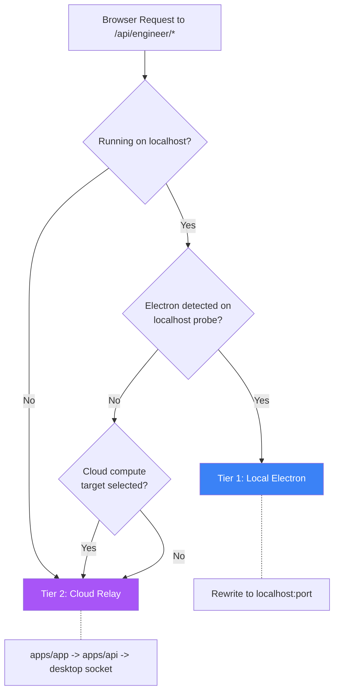
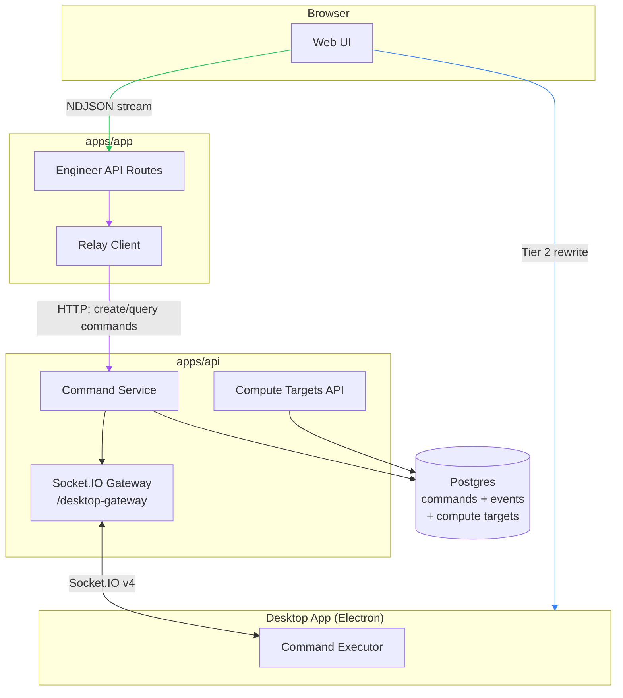
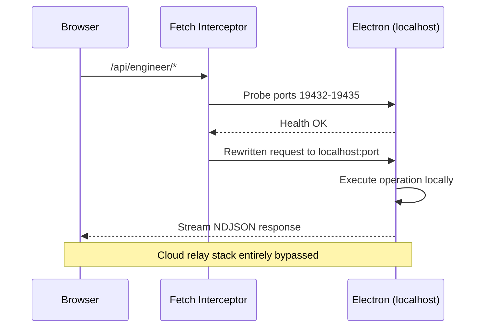
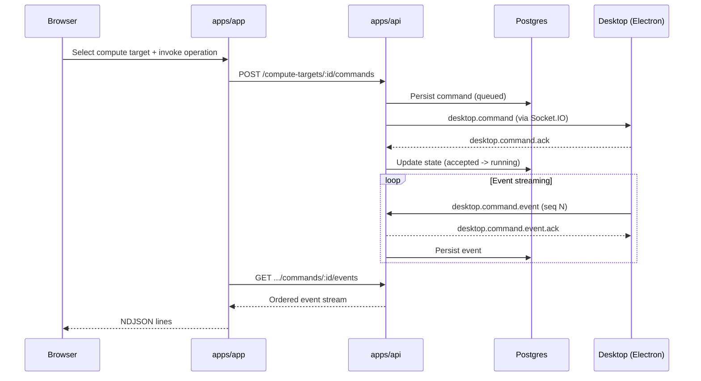
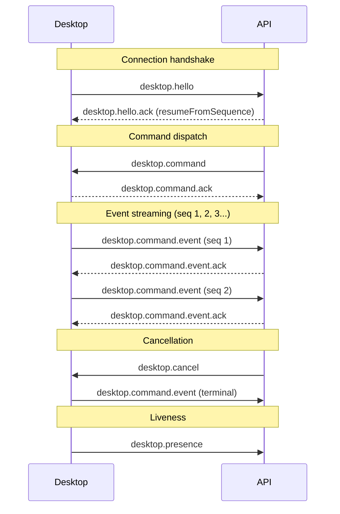
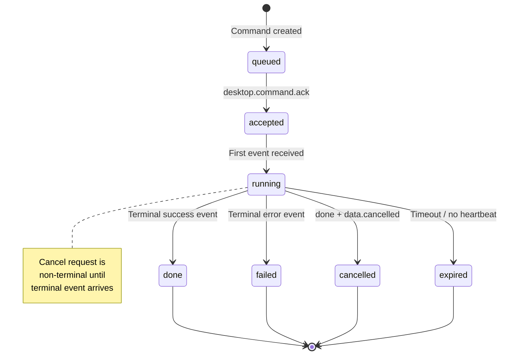

# ClosedLoop Relay Architecture

Last updated: 2026-02-27

## 1. Purpose

This document is the single technical reference for ClosedLoop Relay in `closedloop-ai`.
It consolidates:

- PRD intent and tier model
- Desktop/API Socket.IO contract
- App/API implementation behavior
- Current conformance and migration status

Source docs:

- PRD: ClosedLoop Relay Integration (internal)
- closedloop-electron repo: `docs/artifacts/api-server-socketio-handoff.md`
- `docs/artifacts/relay-integration-contracts.md`
- `docs/artifacts/relay-conformance.md`

## 2. System Goals

1. Prefer direct local execution via Electron when available (Tier 1).
2. Support hosted cross-device relay through API + desktop gateway (Tier 2).
3. Keep browser stream parser compatibility (newline-delimited NDJSON).
4. Maintain secure, user-owned compute target isolation.

## 3. Two-Tier Routing Model

| Tier | Name | Activation | Request Path | Primary Use |
| --- | --- | --- | --- | --- |
| 1 | Local Electron | Electron detected on localhost probe | Browser rewrites `/api/engineer/*` -> `http://localhost:{port}/api/engineer/*` | Primary engineer path, lowest latency |
| 2 | Cloud Relay | Hosted/browser on other device + selected online compute target | Browser -> `apps/app` -> `apps/api` -> desktop gateway socket | Remote operation/monitoring |

Key invariants:

- Tier 1 rewrites all `/api/engineer/*` calls to localhost when Electron is detected.
- Tier 2 supports the full operation surface (not monitoring-only).
- Browser-facing stream framing remains NDJSON lines.

## 4. High-Level Architecture

### 4.1 Core Components

- `apps/app` (web UI + engineer API routes + relay client)
- `apps/api` (compute targets, command persistence, Socket.IO gateway)
- Desktop app (closedloop-electron) as compute executor
- Postgres (command + event durability)

### 4.2 Data/Control Planes

- **Control plane**: command creation, ownership validation, state transitions
- **Data plane**: streaming command events to browser as NDJSON
- **Presence plane**: compute target online/offline via socket session and liveness updates

## 5. Runtime Flows

### 5.1 Tier 1 (Local Electron, direct)

1. Browser probes localhost ports (`19432-19435`) for Electron health.
2. If detected, fetch interceptor rewrites `/api/engineer/*` to localhost gateway.
3. Desktop executes operations locally and streams NDJSON back directly.
4. Cloud relay stack is bypassed for those calls.

### 5.2 Tier 2 (Hosted relay)

1. Browser selects a cloud compute target.
2. `apps/app` relay client creates command via API:
   - `POST /compute-targets/:id/commands`
3. API queues command, dispatches to desktop over Socket.IO `/desktop-gateway`.
4. Desktop emits command events with monotonic sequence numbers.
5. API persists events and exposes ordered stream/log endpoints.
6. `apps/app` reads API event stream and emits NDJSON to browser caller.

## 6. Socket.IO Contract (Desktop <-> API)

Namespace and transport:

- Namespace: `/desktop-gateway`
- Protocol: Socket.IO v4
- Production transport: websocket-only

Shared events:

- Desktop -> API: `desktop.hello`
- API -> Desktop: `desktop.hello.ack`
- API -> Desktop: `desktop.command`
- Desktop -> API: `desktop.command.ack`
- Desktop -> API: `desktop.command.event`
- API -> Desktop: `desktop.command.event.ack`
- API -> Desktop: `desktop.cancel`
- Desktop -> API: `desktop.presence`

Envelope fields on every event payload:

- `protocolVersion: "1"`
- `messageId: string`
- `timestamp: ISO-8601 string`

Command semantics:

- `commandId` is server-generated.
- `idempotencyKey` is optional on command creation.
- Same key + same payload returns existing command.
- Same key + different payload returns `409`.

Replay semantics:

- API authoritative sequence tracking (`last_sequence_acked`).
- Desktop sequence starts at `1`.
- API accepts next contiguous sequence, ignores duplicates, rejects gaps.
- Reconnect resume uses `desktop.hello.ack.resumeFromSequence`.

## 7. Browser Stream Compatibility (Critical)

Relay stream mapping preserves existing parser behavior:

- One persisted command event -> one NDJSON line.
- No SSE `data:` wrappers in browser-facing stream.
- Use event `data` object as top-level line payload.
- Preserve top-level keys (`content`, `error`, `name`, `id`, etc.).
- If no `type`:
  - `chunk + content` -> `type: "text"`
  - else `type = eventType`

This keeps existing `readChatStream()`/engineer parser behavior stable.

## 8. API Surface

### 8.1 Command APIs (current relay contract)

- `POST /compute-targets/:id/commands`
- `GET /compute-targets/:id/commands/:commandId`
- `GET /compute-targets/:id/commands/:commandId/events`

### 8.2 Legacy bridge (still present during migration)

- `POST /compute-targets/:id/operations`
- `POST /compute-targets/:id/results`
- `GET /compute-targets/:id/operations/:operationId/stream`

### 8.3 Compute target APIs

- `GET /compute-targets`
- `POST /compute-targets/register`
- `POST /compute-targets/:id/heartbeat`
- `DELETE /compute-targets/:id` (and related management calls)

## 9. Persistence and State

Durable entities:

- `desktop_commands`
- `desktop_command_events`
- `compute_targets` (with socket/presence metadata)

### 9.1 Relay Schema Changes (Prisma + SQL)

Relay introduced three data models in
`packages/database/prisma/schema.prisma`:

1. `ComputeTarget` (`compute_targets`)
2. `DesktopCommand` (`desktop_commands`)
3. `DesktopCommandEvent` (`desktop_command_events`)

`ComputeTarget` fields:

- identity/ownership: `id`, `organizationId`, `userId`, `machineName`, `platform`
- capability metadata: `capabilities` (JSON), `supportedOperations` (JSON)
- liveness/timestamps: `lastSeenAt`, `isOnline`, `createdAt`, `updatedAt`

`ComputeTarget` constraints/indexes:

- unique: `(userId, machineName)`
- indexes: `(organizationId, userId)`, `(userId, isOnline)`

`DesktopCommand` fields:

- routing/idempotency: `id`, `computeTargetId`, `idempotencyKey`, `requestFingerprint`, `operationId`
- request payload: `requestPayload` (JSON)
- lifecycle: `status`, `error`, `lastSequenceAcked`, `queuedTimeoutMs`, `runningTimeoutMs`
- timing: `createdAt`, `startedAt`, `finishedAt`

`DesktopCommand` constraints/indexes:

- indexes: `(computeTargetId, status, createdAt)`, `(operationId)`, `(computeTargetId, idempotencyKey)`
- partial unique: `(computeTargetId, idempotencyKey)` where `idempotencyKey IS NOT NULL`

`DesktopCommandEvent` fields:

- composite identity: `commandId`, `sequence`
- event payload: `eventType`, `eventPayload` (JSON), `createdAt`

`DesktopCommandEvent` constraints/indexes:

- primary key: `(commandId, sequence)`
- index: `(commandId, createdAt)`

Model relations added:

- `Organization.computeTargets`
- `User.computeTargets`
- `ComputeTarget.desktopCommands`
- `DesktopCommand.events`

### 9.2 Relay Migrations

Relay-related migrations:

- `20260227110000_add_compute_targets`
- `20260227130000_add_desktop_command_persistence`
- `20260227180816_just_db_generate`

Important note on current DB state:

- The first two migrations create relay tables/indexes and originally add FKs from:
  - `desktop_commands.compute_target_id -> compute_targets.id`
  - `desktop_command_events.command_id -> desktop_commands.id`
- `20260227180816_just_db_generate` drops those two FK constraints, so relay tables are currently enforced by application logic + indexes (not DB FK constraints).

Command lifecycle:

Terminal rules:

- `done` + `data.cancelled === true` => `cancelled`
- terminal `error` => `failed`
- cancel request is non-terminal until terminal event arrives

## 10. App-Side Routing/UX Behavior

### 10.1 Engineer routing behavior

- Electron detected => Tier 1 rewrite of all `/api/engineer/*`.
- Hosted + selected online target => Tier 2 relay via command APIs.

### 10.2 Compute target selector behavior

- Shows Local Electron only when local gateway is available.
- Shows cloud targets with online/offline state.
- Dedupe logic prevents duplicate display when a cloud target corresponds to Local Electron.

## 11. Security Model

1. Desktop socket handshake uses API key auth (`sk_live_*`) with strict validation.
2. Compute target ownership enforced per authenticated user/org.
3. Relay path validates operation/method/path allowlist before queueing.
4. Sensitive fields/tokens must be redacted in persisted events/logging.
5. Per-user and per-target rate limiting applies to command creation.
6. Raw API keys are never logged.

Risk considerations:

- This architecture enables remote command execution on a user-owned machine by design.
- Compromise risk centers on key leakage, auth bypass, command allowlist gaps, or insecure desktop approval policy.

## 12. Deployment and Ops Notes

1. API socket gateway requires the custom API server bootstrap (`apps/api/server.ts`) so Next + Socket.IO share origin/port.
2. For multi-instance API, use Socket.IO adapter/pubsub and sticky sessions.
3. Rollout must keep compute target visibility/liveness intact for hosted guard and settings views.
4. Remove legacy register/heartbeat only after socket-driven liveness parity is verified.

## 13. Current Conformance Status

From `docs/artifacts/relay-conformance.md`:

- Tier 1 rewrite behavior: pass
- Tier 2 full operation relay: pass
- Socket gateway contract implementation: pass
- NDJSON parser compatibility: pass
- Durable command/event persistence: pass
- Idempotency and state transitions: pass

Known migration gap:

- Liveness is still dual-mode during migration (socket presence + legacy register/heartbeat compatibility paths).

## 14. Team Coordination Rules

1. Contract source of truth is `api-server-socketio-handoff.md`.
2. If shared fields change (event names, payload keys, state transitions, NDJSON mapping), update contract doc first, then implement.
3. Avoid cross-repo edits by the wrong agent; coordinate by contract updates.
4. Keep compute-target list/liveness semantics stable across transport migrations.

## 15. Quick Reference

- Primary direct path: Tier 1 (local Electron rewrite)
- Hosted remote path: Tier 2 (command APIs + socket dispatch)
- Parser compatibility requirement: browser always receives NDJSON lines
- Ownership requirement: compute targets are private to authenticated owner/org
