# Browser Command Signing Command Dispatch Flow

This flow shows what happens when the web app sends a Desktop command to Electron through the new browser-origin command signing path.

```mermaid
flowchart TD
    Start["User action needs a Desktop command"] --> Target["App has selected compute target"]
    Target --> ServerSupport{"serverCapabilities computeTargetSigning true?"}
    ServerSupport -->|"No"| Legacy["Send legacy unsigned command"]
    ServerSupport -->|"Yes"| DesktopSigning{"Target capabilities commandSigning true?"}

    DesktopSigning -->|"No"| Legacy
    DesktopSigning -->|"Yes"| Sign["Browser opportunistically signs command"]

    Sign --> LocalKey["Load or create browser Ed25519 key from IndexedDB"]
    LocalKey --> Canonical["Build canonical payload with commandId method path sorted query bodyHash timestamp nonce"]
    Canonical --> Signature["Sign canonical payload with non-exportable private key"]
    Signature --> SignedFields["Attach commandId signature signaturePayload and publicKeyFingerprint"]

    Legacy --> ApiCommand["POST /compute-targets/:id/commands"]
    SignedFields --> ApiCommand

    ApiCommand --> ApiTarget["API loads accessible compute target"]
    ApiTarget --> OwnerFlag["Resolve target owner Clerk ID and compute-target-signing PostHog flag"]
    OwnerFlag --> ApiServerSupport{"Server flag compute-target-signing true?"}
    ApiServerSupport -->|"No"| Persist
    ApiServerSupport -->|"Yes"| ApiDesktopSigning{"Desktop advertised capabilities commandSigning?"}
    ApiDesktopSigning -->|"No"| Persist
    ApiDesktopSigning -->|"Yes"| ApiOptIn{"Desktop advertised capabilities commandSigningRequired?"}

    ApiOptIn -->|"No"| Persist["Create desktop_commands row"]
    ApiOptIn -->|"Yes"| SignaturePresent{"Command has signature fields?"}
    SignaturePresent -->|"No"| ApiReject["Return 400 command signing required"]
    SignaturePresent -->|"Yes"| NamespaceOk{"Signed payload matches API command namespace?"}
    NamespaceOk -->|"No"| ApiRejectNamespace["Return 400 signed path mismatch"]
    NamespaceOk -->|"Yes"| Persist

    Persist --> PersistNote["Signature material is not persisted in desktop_commands"]
    PersistNote --> Relay["Build relay operation and reattach signature fields to wire command"]
    Relay --> Delivered{"Relay delivers to online Desktop?"}
    Delivered -->|"No signed command"| Expire["Expire command as signed_command_delivery_failed"]
    Delivered -->|"No unsigned command"| QueueOrReturn["Leave legacy command queued or return current status"]
    Delivered -->|"Yes"| DesktopReceive["Electron cloud socket receives desktop.command"]

    DesktopReceive --> ElectronServerSupport{"Electron knows server support is true?"}
    ElectronServerSupport -->|"No"| IgnoreSig["Accept legacy path and ignore signature fields if present"]
    ElectronServerSupport -->|"Yes"| ElectronOptIn{"Desktop local command-signing opt-in enabled?"}
    ElectronOptIn -->|"No"| LegacyAccept["Enforcement off; accept legacy unsigned commands and ignore or accept signed commands through legacy path"]
    ElectronOptIn -->|"Yes"| SignatureOnWire{"Wire command has signature fields?"}
    SignatureOnWire -->|"No"| AckReject["Ack failed because command signing is required"]
    SignatureOnWire -->|"Yes"| Verify["CommandSignatureVerifier.verify"]

    Verify --> Authorized{"Fingerprint exists in Electron authorized_keys.json?"}
    Authorized -->|"No"| AckRejectUnknown["Ack failed with no keys authorized or unknown signing key"]
    Authorized -->|"Yes"| PayloadChecks["Parse payload check timestamp nonce commandId method path query and bodyHash"]
    PayloadChecks --> PayloadOk{"Payload matches command and is fresh?"}
    PayloadOk -->|"No"| AckRejectInvalid["Ack failed because signed payload is invalid or stale"]
    PayloadOk -->|"Yes"| CryptoCheck["Verify Ed25519 signature over signaturePayload"]
    CryptoCheck --> SignatureOk{"Signature valid?"}
    SignatureOk -->|"No"| AckRejectInvalid
    SignatureOk -->|"Yes"| Prepare["Prepare command for execution"]

    Prepare --> LoopIntent{"Command is signed loop launch intent?"}
    LoopIntent -->|"No"| Execute["Execute local gateway request"]
    LoopIntent -->|"Yes"| FetchCreds["Desktop calls execution-credentials endpoint with Desktop PoP"]
    FetchCreds --> CredsApi["API verifies Desktop-managed API key PoP target gateway loop command row and one-shot consumption"]
    CredsApi --> CredsOk{"Credentials request valid and unused?"}
    CredsOk -->|"No"| AckRejectInvalid
    CredsOk -->|"Yes"| ReplaceBody["Desktop replaces intent body with loop execution credentials"]
    ReplaceBody --> Execute

    IgnoreSig --> Execute
    LegacyAccept --> Execute
    Execute --> Events["Desktop emits result events and ack state back through relay"]

    AckReject --> LoopLaunch{"Rejected command was loop launch key-authorization failure?"}
    AckRejectUnknown --> LoopLaunch
    AckRejectInvalid --> Events
    LoopLaunch -->|"Yes"| LoopFail["API fails the loop immediately"]
    LoopLaunch -->|"No"| Events
    LoopFail --> Events
```

## Important Trust Boundaries

- Browser signs the user's intent or Desktop HTTP command using a local non-exportable private key.
- Browser signs opportunistically when both the server capability `computeTargetSigning` and Desktop capability `commandSigning` are present. Browser does not need to know whether Desktop enforcement is enabled.
- API requires signatures only when server support, Desktop `commandSigning`, and Desktop `commandSigningRequired` are all true.
- API stores the command row without signature material, then attaches signature fields only to the relay wire payload.
- Electron enforces signatures only when server support is true and the user enabled the Desktop-local opt-in setting.
- Electron validates against locally authorized public keys in `~/.closedloop/authorized_keys.json`, not against API `user_public_keys` or compute-target database state.
- Browser registration alone is insufficient for enforcement. If Electron has not authorized the fingerprint, signed commands are rejected only when Desktop enforcement is active.
- If enforcement is off, legacy unsigned commands continue to work and signed commands are ignored or accepted through Desktop's legacy path.
- If enforcement is on and a signed loop launch uses an unknown browser key, Desktop rejects the command and API fails the loop immediately.
- Loop launch keeps server-only credentials out of the browser. After signature verification, Electron fetches one-shot loop execution credentials through the existing Desktop-managed PoP channel.

## Primary Code Paths

- Browser signer: `apps/app/lib/crypto/command-signer.ts`
- Relay client and gateway proxy: `apps/app/lib/engineer/relay-client.ts`, `apps/app/app/api/gateway-relay/[...path]/route.ts`
- Command API route: `apps/api/app/compute-targets/[id]/commands/route.ts`
- Relay dispatch conversion: `apps/api/app/compute-targets/relay-command-helpers.ts`, `apps/api/lib/desktop-gateway-wire.ts`
- Loop intent dispatch: `apps/api/lib/loops/loop-desktop.ts`
- Loop credentials endpoint: `apps/api/app/compute-targets/[id]/loops/[loopId]/execution-credentials/route.ts`
- Electron verifier: `closedloop-electron/apps/desktop/src/main/command-signature-verifier.ts`
- Electron command executor: `closedloop-electron/apps/desktop/src/main/cloud-command-executor.ts`
- Electron loop credential fetch: `closedloop-electron/apps/desktop/src/main/loop-command-preparer.ts`, `closedloop-electron/apps/desktop/src/main/loop-execution-credentials-client.ts`
