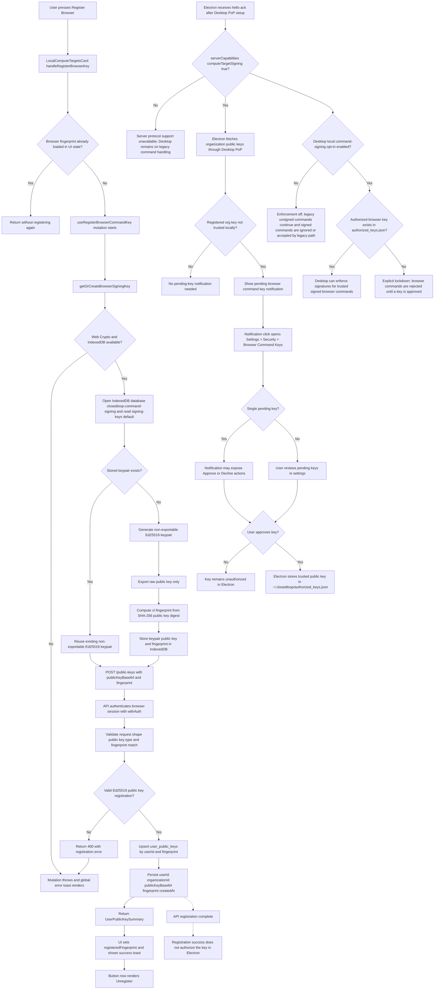

# Browser Command Signing Registration Flow

This flow shows what happens when a user presses **Register Browser** in the local compute target settings panel.

## Storage Boundaries

- Browser private key: stored locally in IndexedDB as a non-exportable `CryptoKeyPair`.
- API registration: stored in `user_public_keys` by `(userId, fingerprint)`, scoped to the user's organization.
- Compute target: does not store the browser key or browser fingerprint.
- Electron authorization: stored separately in Desktop's local `~/.closedloop/authorized_keys.json`.

## What Registration Does Not Do

Registering the browser stores the public key in API `user_public_keys`. That is
not the same as Electron authorization and does not enable enforcement. Electron
may later discover the pending key through Desktop PoP and ask the user to
approve it, but trusted keys live separately in Desktop's local
`~/.closedloop/authorized_keys.json`.

The server feature flag `compute-target-signing` means protocol support is
available. Actual Desktop enforcement is controlled by the local opt-in setting:
with opt-in off, legacy unsigned commands continue to work; with opt-in on and
no trusted key, browser commands are rejected until approval.

## Primary Code Paths

- Browser key storage: `apps/app/lib/crypto/key-store.ts`
- Register mutation: `apps/app/hooks/queries/use-public-keys.ts`
- Settings UI: `apps/app/app/(authenticated)/settings/components/local-compute-targets-card.tsx`
- API route and service: `apps/api/app/public-keys/route.ts`, `apps/api/app/public-keys/service.ts`
- Database models: `packages/database/prisma/schema.prisma`
- Desktop approval store: `closedloop-electron/apps/desktop/src/main/authorized-command-key-store.ts`
